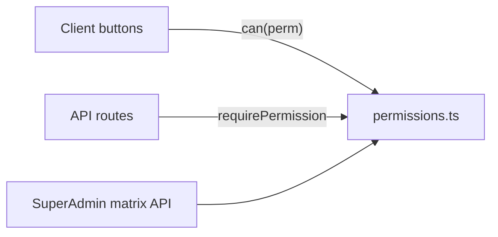

# CRUD + role-gated UI for projects, tasks, sprints

## Current state

- **APIs mostly complete** for projects, tasks, sprints, milestones, standups (upsert), retros, burndown.
- **Role gates missing** on those mutate routes — any logged-in user can mutate.
- **Docs matrix already defines intent** in [`src/app/api/super-admin/permissions/route.ts`](src/app/api/super-admin/permissions/route.ts):
  - **admin / superadmin**: full project + task CRUD
  - **member**: view projects; create/edit/delete/assign tasks; no project create/edit/delete
- **UI pattern to copy**: teams — [`teams/page.tsx`](src/app/dashboard/teams/page.tsx) passes `canManage` / `canDelete` into [`TeamManagementClient.tsx`](src/app/dashboard/teams/TeamManagementClient.tsx).
- **Dead prop**: `userRole` on [`ProjectListClient.tsx`](src/app/dashboard/projects/ProjectListClient.tsx) unused; New Project always shown.

## Permission matrix (enforced)

Extend matrix with sprint permissions (same shape as projects). Single source of truth:

| Permission | superadmin | admin | member |
|---|---|---|---|
| `view_projects` / `view_tasks` / `view_sprints` | yes | yes | yes |
| `create/edit/delete_projects` | yes | yes | no |
| `create/edit/delete_tasks`, `assign_tasks` | yes | yes | yes |
| `create/edit/delete_sprints`, `complete_sprint` | yes | yes | no |
| milestones (under project edit) | yes | yes | no |
| standup upsert (own) | yes | yes | yes |
| retro create/edit/delete (own; admin+ any) | yes | yes | own only |

## Implementation

### 1. Shared permissions module

Add [`src/lib/permissions.ts`](src/lib/permissions.ts):

- Export `PERMISSIONS`, `ROLE_PERMISSIONS`, `hasPermission(role, id)`, `requirePermission(user, id)`.
- Move matrix data out of the super-admin route; that route imports from here (display stays in sync with enforcement).
- Keep `requireRole` for coarse checks; prefer `requirePermission` on entity APIs.

### 2. Enforce on APIs

After `getSession()`:

- **Projects** [`api/projects`](src/app/api/projects/route.ts), [`api/projects/[id]`](src/app/api/projects/[id]/route.ts): POST → `create_projects`; PATCH → `edit_projects`; DELETE → `delete_projects`.
- **Milestones** [`api/projects/[id]/milestones`](src/app/api/projects/[id]/milestones/route.ts), [`api/milestones/[id]`](src/app/api/milestones/[id]/route.ts): mutate → `edit_projects`.
- **Tasks** [`api/tasks`](src/app/api/tasks/route.ts), [`api/tasks/[id]`](src/app/api/tasks/[id]/route.ts): map to `create_tasks` / `edit_tasks` / `delete_tasks` (members allowed per matrix).
- **Sprints** [`api/sprints`](src/app/api/sprints/route.ts), [`api/sprints/[id]`](src/app/api/sprints/[id]/route.ts): create/edit/delete/complete → sprint perms; GET stays auth-only.
- **Standups** [`api/standups`](src/app/api/standups/route.ts): force `userId = session.id` (no write-as-other).
- **Retros** [`api/retros`](src/app/api/retros/route.ts), [`api/retros/[id]`](src/app/api/retros/[id]/route.ts): create = any auth; PATCH/DELETE = author or admin+.

Return `403` with `{ error: "Forbidden" }` (match teams).

### 3. Role-gated UI (hide buttons)

Pass capabilities from server pages (like teams), or compute client-side from session role via `hasPermission`.

| Surface | Gate |
|---|---|
| [`ProjectListClient`](src/app/dashboard/projects/ProjectListClient.tsx) | New Project → `create_projects` |
| [`ProjectManagementPanel`](src/app/dashboard/projects) | Edit / Delete / milestones mutate → `edit_projects` / `delete_projects` |
| [`SprintsClient`](src/app/dashboard/sprints/SprintsClient.tsx) | Create / Set active / Delete → sprint perms |
| [`SprintDetailClient`](src/app/dashboard/sprints/[id]/SprintDetailClient.tsx) | Complete sprint / planning mutate → admin+; standup + retro forms stay for members |
| Kanban / [`TaskDetailModal`](src/components) / backlog | Create/edit/delete task → task perms (all roles today — still wire so matrix changes later are one-line) |

### 4. Fill CRUD gaps (same pass)

- **Project delete**: wire existing DELETE + `useDeleteProject` in project list/detail; confirm dialog; admin+ only.
- **Retro edit**: add `useUpdateRetroItem` in [`useRetros.ts`](src/hooks/useRetros.ts); inline edit in RetroPanel (API PATCH already exists).
- **Projects hooks**: prefer [`useProjects`](src/hooks/useProjects.ts) mutations where panel still uses raw `fetch` (create/update/delete) for consistent optimistic updates.
- Out of scope: project notes API/UI, Gantt, teams invite (separate TODOs).

### 5. Docs

Update [`STRUCTURE.md`](STRUCTURE.md) (permissions lib, matrix fields, API auth notes), [`AGENTS.md`](AGENTS.md) API table if needed, [`TODO.md`](TODO.md) mark related items done.

## Verify

- `deno task lint` / `typecheck`
- Manual: login as **member** — no New Project / Delete Project / Create Sprint / Complete sprint; can still CRUD tasks, submit standup, add/delete own retro.
- Login as **admin** — full project/sprint/task controls.
- API smoke: member POST `/api/projects` → 403.
