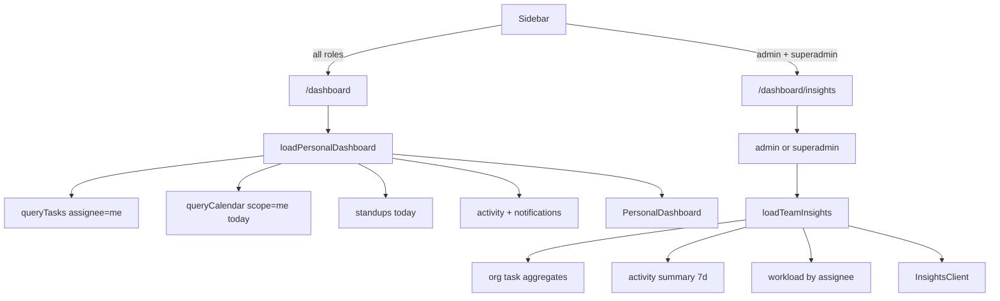

# Personal dashboard + Insights page

## Decision (updated)

- **`/dashboard`** — personal “My Day” for **all** roles (member, admin, superadmin). No role branch on home.
- **`/dashboard/insights`** — new page for **team/company performance**. Visible to **admin + superadmin** only (same gate pattern as `/dashboard/admin`). Members stay on personal home + existing Activity/Calendar.

Compose server-side loaders from existing query helpers. No new `/api/dashboard` in this pass.

## Current state

[`src/app/dashboard/page.tsx`](src/app/dashboard/page.tsx) is org-wide vanity stats for everyone. No assignee filter, no “today”.

Building blocks:

- [`queryTasks`](src/lib/query-tasks.ts) — `assigneeId`, `dueFrom`/`dueTo`, `excludeDone`
- [`queryCalendar`](src/lib/query-calendar.ts) — `scope=me`, schedules + due tasks
- Activity summary from [`/api/activity`](src/app/api/activity/route.ts) (`today`, `last7d`, `topActors`, `byDay`)
- App timezone via [`getAppTimezone`](src/lib/timezone-server.ts) + [`toAppDateKey`](src/lib/timezone.ts)
- UI: white bordered cards, slate/brand (match Activity/Calendar)

## Architecture



## 1. Data loaders (server-only)

Add:

- [`src/lib/dashboard-personal.ts`](src/lib/dashboard-personal.ts) — `loadPersonalDashboard(user)`
- [`src/lib/dashboard-insights.ts`](src/lib/dashboard-insights.ts) — `loadTeamInsights()` (company/org aggregates)

**Personal payload (app timezone “today”):**

- Counts: my open / due today / overdue / in review (`queryTasks`)
- Due today + schedules: `queryCalendar` `scope=me`, layers `tasks,schedules`
- Focus: my `in_progress` + `review`, limit ~8
- Standup: today’s standup row(s) for `userId`
- Updates: unread notifications (~5) + recent activity `userId=me` (~8)

**Insights payload (org-wide):**

- Pulse: active projects, open tasks, done this week, overdue, urgent open
- Throughput: status + priority breakdowns
- Activity: `today`, `last7d`, `activeUsers7d`, `byDay`, `topActors` (extract shared helper from activity route if duplicated)
- Workload: top assignees by open-task count
- Recent: latest ~10 global activity rows

Keep DB in loaders / existing libs. No `pg` in client components.

## 2. Personal home UI

[`src/app/dashboard/page.tsx`](src/app/dashboard/page.tsx) always:

```tsx
const user = await getSession();
const data = await loadPersonalDashboard(user!);
return <PersonalDashboard data={data} user={user!} />;
```

Component: `PersonalDashboard` (presentational; colocated under `src/components/dashboard/` or `src/app/dashboard/`).

Layout:

1. Header: first name + formatted today (timezone)
2. 4 personal stat chips
3. Two columns: **Due today** | **Focus**
4. **Standup** strip (or CTA → sprints)
5. **Updates**: notifications + my activity ([`activity-ui`](src/lib/activity-ui.ts))

Preserve card classes (`bg-white border border-slate-200 rounded-xl`).

## 3. New Insights page

Files:

- [`src/app/dashboard/insights/page.tsx`](src/app/dashboard/insights/page.tsx) — session + role gate (`admin` | `superadmin` → else `redirect("/dashboard")`); load `loadTeamInsights()`; render UI
- `InsightsClient.tsx` (or split server presentational + tiny client chart) — Recharts 7d bar like [`ActivityClient.tsx`](src/app/dashboard/activity/ActivityClient.tsx)

Layout:

1. Header: “Insights” / team performance + today
2. Pulse stats
3. Row: 7d activity chart | top contributors | workload bars
4. Status/priority breakdowns
5. Recent activity + links to `/dashboard/activity` (and superadmin → `/dashboard/super-admin` for ops)

## 4. Nav + access

[`src/components/Sidebar.tsx`](src/components/Sidebar.tsx): add Insights link (e.g. `BarChart3` / `TrendingUp`) after Activity or Calendar, only when `user.role === "admin" || user.role === "superadmin"`.

No new permission id required for v1 (mirror Admin page role check). Optional later: `view_insights` in [`permissions.ts`](src/lib/permissions.ts).

## 5. Lib cleanup

- If activity summary queries duplicated → [`src/lib/activity-summary.ts`](src/lib/activity-summary.ts); use from `/api/activity` + insights loader.
- `dueFrom`/`dueTo` on `GET /api/tasks` — optional, not required for RSC home.

## 6. Docs

- [`STRUCTURE.md`](STRUCTURE.md) — personal home, insights route/components, loaders, sidebar
- [`TODO.md`](TODO.md) — mark home revamp + insights page; leave full velocity reporting as separate item
- [`AGENTS.md`](AGENTS.md) — add Insights to API/routes table only if needed; skip if no convention change

## Out of scope

- Redesigning `/dashboard/super-admin` ops panels
- Full velocity/burndown reporting suite
- Member access to Insights (can open later)
- New chart library beyond Recharts

## Verify

`deno task lint`, `deno task typecheck`, `deno task build` — no client→`@/db` leaks.
