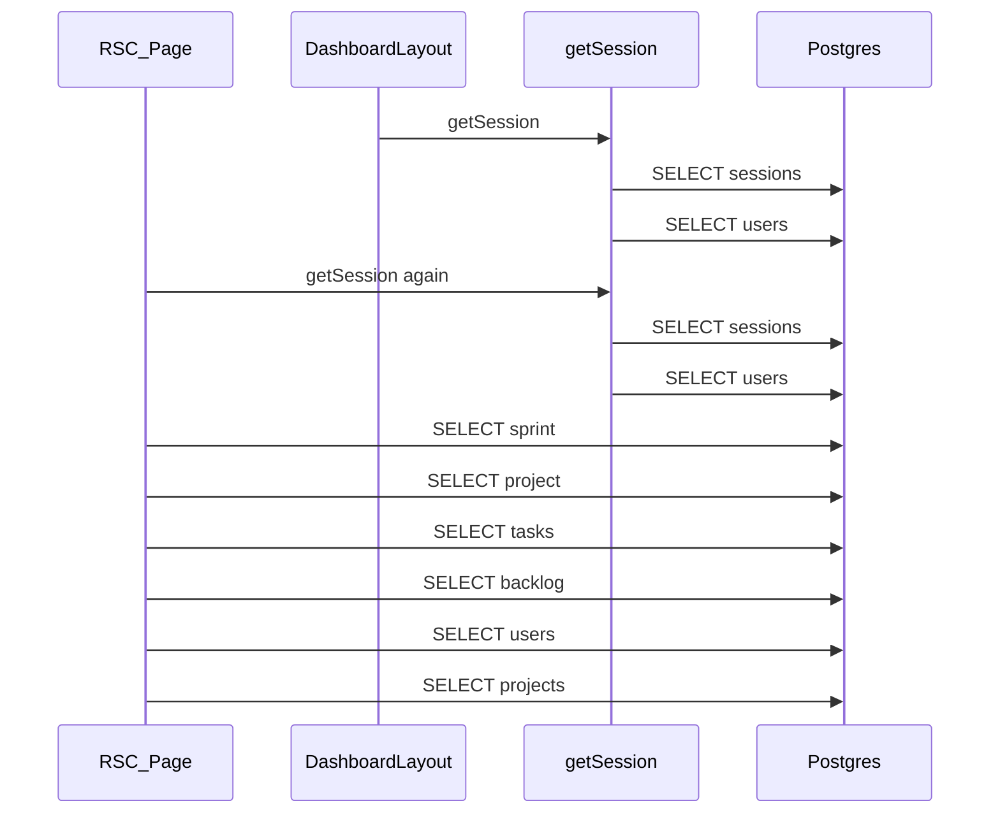

# DB and Process Optimization

## Problem

Hot path today:



Worst offenders: sequential 2-query `getSession` with no request memoization; untuned `Pool`; no FK indexes; RSC pages that await queries in series (e.g. sprint detail); mutations that block response on activity-log insert.

## Scope (committed choices)

- Auth cache + single JOIN (not JWT rewrite)
- Pool tuning defaults (not PgBouncer)
- FK indexes via Drizzle migration
- Parallelize heavy RSC data loads (sprint detail first pattern, then same for other dashboard pages that do sequential fetches)
- Defer activity logging with Next.js `after()` (not fire-and-forget without lifecycle, not full rewrite of every route into transactions)
- Async bcrypt on login only

## 1. Auth: one query, once per request

Edit [`src/lib/auth.ts`](src/lib/auth.ts):

- Wrap `getSession` in React `cache()` so layout + page share one lookup per RSC request
- Replace two sequential selects with one `sessions` LEFT JOIN `users` filtered by `sessionId` + `expiresAt > now()`
- Keep delete-on-expiry / missing-user cleanup as-is (rare path)
- Switch `compareSync` → `compare` (async) in `authenticateUser` so login does not block the event loop

```ts
import { cache } from "react";
import { and, eq, gt } from "drizzle-orm";

export const getSession = cache(async (): Promise<AuthUser | null> => {
  // cookies() + single join query
});
```

No call-site changes required; layout already passes `user` into `ClientLayout`, and `/api/auth/me` only used by [`src/hooks/useRealtime.ts`](src/hooks/useRealtime.ts).

## 2. Pool: keep warm connections

Edit [`src/db/index.ts`](src/db/index.ts):

```ts
new Pool({
  connectionString: databaseUrl,
  max: 10,
  idleTimeoutMillis: 30_000,
  connectionTimeoutMillis: 5_000,
  allowExitOnIdle: true,
})
```

Keep existing `globalThis` singleton in non-production so Turbopack HMR does not leak pools. Production still uses module singleton (Deno Deploy / Node process lifetime).

## 3. Indexes on hot FK / order columns

Edit [`src/db/schema.ts`](src/db/schema.ts) — add Drizzle `.index()` / `index()` on:

- `sessions.user_id`
- `tasks.project_id`, `tasks.sprint_id`, `tasks.assignee_id`
- `sprints.project_id`
- `comments.task_id`
- `team_members.team_id`, `team_members.user_id`
- `activity_logs.created_at` (list endpoint orders by this)
- `standups.user_id` + `standups.date` if queried together

Run `deno task db:generate` then `deno task db:migrate` (local). Commit SQL under `drizzle/`.

## 4. Parallelize heavy RSC pages

Exemplar: [`src/app/dashboard/sprints/[id]/page.tsx`](src/app/dashboard/sprints/[id]/page.tsx)

Today: sprint → project → sprintTasks → backlog → users → projects (serial).

After auth (needed for `currentUserId`):

```ts
const [project, sprintTasks, backlogTasks, allUsers, allProjects] =
  await Promise.all([/* five independent queries */]);
```

Also tighten backlog filter to unassigned-to-sprint only (`isNull(tasks.sprintId)` or `ne(tasks.sprintId, id)` depending on product intent — use `or(isNull(sprintId), ne(sprintId, id))` only if UI needs tasks from other sprints; default: `isNull(tasks.sprintId)` for planning backlog).

Apply same `Promise.all` pattern to other dashboard server pages that currently chain independent selects (projects detail, kanban, admin, etc.) — same file touch style, no API shape changes.

## 5. Defer activity-log writes

Add small helper e.g. [`src/lib/activity.ts`](src/lib/activity.ts):

```ts
import { after } from "next/server";
import { db } from "@/db";
import { activityLogs } from "@/db/schema";

export function logActivity(input: {...}) {
  after(async () => {
    await db.insert(activityLogs).values(input);
  });
}
```

Replace blocking `await db.insert(activityLogs)...` in mutating API routes with `logActivity(...)`. Response returns after entity write; log runs after response is sent. Document convention in [`AGENTS.md`](AGENTS.md) Activity Logging section.

## 6. Dev process: Turbopack root

Edit [`next.config.ts`](next.config.ts) — set `turbopack.root` to this repo path so Next stops walking up to `/Users/azlanshah/package-lock.json` (current warning in terminal). Reduces wrong-root compile overhead in local digests.

## Docs

- [`STRUCTURE.md`](STRUCTURE.md): note `logActivity`, auth `cache`, pool settings, new indexes
- [`AGENTS.md`](AGENTS.md): activity logging via `after()`; keep action name list
- [`TODO.md`](TODO.md): mark completed / add follow-ups only if discovered

## Verification

1. `deno task lint` / `typecheck` / `build`
2. Manual: cold load `/dashboard/sprints/[id]` then `/api/auth/me` — expect lower `application-code` ms after warm pool; second `getSession` in same RSC must not double-query (Spot-check via temporary logging or Drizzle query count if desired)
3. Mutation (create task/sprint): UI success immediate; activity row appears shortly after
4. `deno task db:migrate` applies index migration cleanly

## Out of scope

- JWT/cookie-blob sessions
- Moving all dashboard data to client-only React Query
- PgBouncer / read replicas
- Rewriting every list API query shape beyond indexes + parallel RSC
