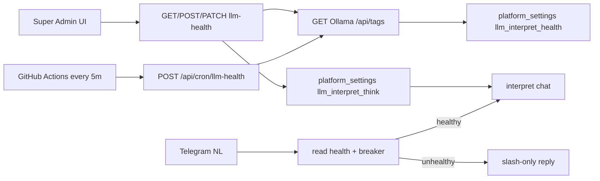

# LLM interpret health watchdog + think toggle

## Constraint (scheduler choice)

App runs **Next.js Node** on Deno Deploy via `jsr:@deno/nextjs-start` ([`src/instrumentation.ts`](src/instrumentation.ts)). Native [`Deno.cron()`](https://docs.deno.com/deploy/reference/cron/) must register at Deno entrypoint top-level before `Deno.serve` — **not available** on this deploy path.

**Scheduler:** secret-protected HTTP route + **GitHub Actions** `schedule` every 5 min. Same route callable manually / from other pingers.

Mac Mini `launchd` for Ollama/ngrok stays **ops outside the app** (docs tip only). Cron cannot restart Mac services.



## 1. Health module

New [`src/lib/telegram-interpret/health.ts`](src/lib/telegram-interpret/health.ts):

- **`probeLlmHealth()`** — if `LLM_INTERPRET_URL` unset → `{ ok: false, reason: "not_configured" }`. Else `GET {base}/api/tags` (same Bearer / ngrok headers as interpret), **5s** timeout. Confirm `LLM_INTERPRET_MODEL` (default `gemma4:e2b`) appears in `models[].name`.
- Persist JSON under platform key **`llm_interpret_health`** via [`getPlatformSetting` / `setPlatformSetting`](src/lib/platform-settings.ts):

```ts
{
  ok: boolean;
  checkedAt: string;      // ISO
  latencyMs: number | null;
  model: string;
  error: string | null;
  consecutiveFailures: number;
  source: "cron" | "probe" | "breaker";
}
```

- **`getLlmHealth()`** — parse stored JSON (null → treat as unknown/ok-to-try once).
- **`isLlmHealthyForNl()`** — used by bot:
  - URL unset → false (existing behavior).
  - `ok === false` and `checkedAt` within **10 min** → false (fail-fast).
  - stale / missing → true (allow one attempt so a dead cron does not lock NL forever).

## 2. Circuit breaker in interpret path

Extend [`src/lib/telegram-interpret/ollama.ts`](src/lib/telegram-interpret/ollama.ts):

- Before fetch: if `!isLlmHealthyForNl()` → throw/return typed failure (no network call).
- On timeout / network / non-OK HTTP: bump `consecutiveFailures`; if **≥ 3**, set `ok: false`, `source: "breaker"`.
- On successful interpret: reset failures, set `ok: true`, `source: "breaker"` (light touch — do not require full `/api/tags` on every chat).
- Replace hardcoded `think: true` with **`await getInterpretThinkEnabled()`** (see §5a). Default **on** when setting missing (same as today — needed for date/year quality).

Reuse existing user-facing copy in [`nl-flow.ts`](src/lib/telegram-bot/nl-flow.ts) when gate/breaker blocks (“Couldn't reach… use `/event` or `/task`”).

## 3. Cron HTTP route

New [`src/app/api/cron/llm-health/route.ts`](src/app/api/cron/llm-health/route.ts):

- `POST` (and `GET` for simple curl) — require `Authorization: Bearer ${CRON_SECRET}` (or `x-cron-secret`). Missing/wrong → 401. `CRON_SECRET` unset → 503.
- Run `probeLlmHealth({ source: "cron" })`, return stored snapshot JSON.
- `export const dynamic = "force-dynamic"`.

Env: **`CRON_SECRET`** (Deno Deploy + GitHub Actions secret). Document in [`AGENTS.md`](AGENTS.md).

## 4. GitHub Actions schedule

New [`.github/workflows/llm-health-cron.yml`](.github/workflows/llm-health-cron.yml):

```yaml
on:
  schedule:
    - cron: "*/5 * * * *"   # UTC
  workflow_dispatch:
```

- `curl -fsS -X POST -H "Authorization: Bearer $CRON_SECRET" "$APP_URL/api/cron/llm-health"`
- Repo secrets: `APP_URL` (prod origin), `CRON_SECRET` (same as Deploy).

First Actions cron repo in this project — keep workflow minimal.

## 5. Super Admin status

- **API:** [`src/app/api/super-admin/telegram/llm-health/route.ts`](src/app/api/super-admin/telegram/llm-health/route.ts) — superadmin only (same pattern as [`test/route.ts`](src/app/api/super-admin/telegram/test/route.ts)). `GET` → stored status + `configured` flag + `thinkEnabled`. `POST` → force `probeLlmHealth({ source: "probe" })`.
- **UI:** card on [`SuperAdminTelegramPanel.tsx`](src/app/dashboard/super-admin/SuperAdminTelegramPanel.tsx) — configured / healthy / down, last check, latency, model, error snippet, **Probe now** button. No Mac restart controls.

Optional one-line tip on Settings Telegram section: NL needs healthy local Ollama (already partially documented).

## 5a. Super Admin: enable/disable Ollama thinking

Today [`ollama.ts`](src/lib/telegram-interpret/ollama.ts) hardcodes `think: true`. Expose toggle so admin can trade latency vs quality without redeploy.

- **Storage:** `platform_settings` key **`llm_interpret_think`** — values `"true"` / `"false"`. Missing → treat as **`true`** (preserve current behavior).
- **Helpers** in health module or small `settings.ts` next to interpret: `getInterpretThinkEnabled(): Promise<boolean>`, `setInterpretThinkEnabled(enabled: boolean)`.
- **API:** extend llm-health route (or PATCH on same/settings sibling):
  - `GET` includes `thinkEnabled: boolean`
  - `PATCH` body `{ thinkEnabled: boolean }` → persist setting (superadmin only)
- **UI:** same Telegram LLM card — checkbox/switch **“Enable model thinking”** with short note: faster when off; date/year accuracy may drop (known tradeoff from local Ollama tests). Save on toggle (or Save button matching panel patterns).
- **Interpret:** each chat request reads setting and sets Ollama body `think` accordingly. No env var override (admin UI is source of truth; avoids Deploy env churn).

## 6. Docs

- [`AGENTS.md`](AGENTS.md): `CRON_SECRET`, Actions secrets, probe behavior, `llm_interpret_think` platform setting, note that Deploy cron ≠ `Deno.cron` for this app.
- [`STRUCTURE.md`](STRUCTURE.md): new lib + API routes + workflow.
- Short comment in health module: Mac Mini launchd is separate ops.

## Out of scope

- `Deno.cron()` registration
- Auto-restart Ollama/ngrok
- Changing interpret model/prompt beyond gating + think flag
- Alerting (email/Telegram push to admin) — can add later on `ok` false transition

## Verify

- Local: set URL + `CRON_SECRET`, `curl` cron route, confirm `platform_settings` row; force bad URL → breaker after 3 fails → NL fail-fast; Probe now recovers after URL fixed.
- Toggle think off in Super Admin → next NL request sends `think: false`; toggle on → `think: true`. Missing setting still thinks.
- `deno task typecheck` / lint on touched files.
- After Deploy: set `CRON_SECRET`, add Actions secrets, run `workflow_dispatch`, confirm Super Admin card updates.
