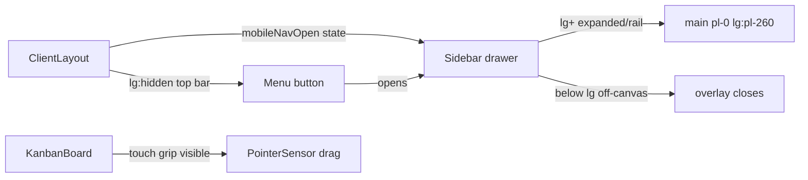

# Mobile Responsive Improvements (Phase 7 — Item 1)

## Context
`TODO.md` Phase 7 has two mobile items: "Mobile responsive improvements" and "Mobile-first limited-feature mode". Per your choice, this plan covers **responsive improvements only** (collapsible/drawer sidebar, touch-friendly Kanban, consistent spacing, no horizontal overflow). **PWA (manifest + service worker) is deferred** to a later pass.

Current state from code:
- `src/components/Sidebar.tsx` is `fixed inset-y-0 left-0 ... w-[260px]` (or `w-[70px]` collapsed). Always visible.
- `src/app/dashboard/ClientLayout.tsx` main uses `pl-[260px]` unconditionally and renders no mobile chrome.
- `src/app/layout.tsx` has no explicit `viewport` export (Next default applies, but make explicit).
- Kanban boards ([`KanbanBoardClient.tsx`](src/app/dashboard/kanban/KanbanBoardClient.tsx), [`KanbanBoard.tsx`](src/app/dashboard/projects/[id]/KanbanBoard.tsx)) already scroll horizontally (`overflow-x-auto`, `w-72` columns) but drag grip is `opacity-0 group-hover:opacity-100` → invisible on touch.
- Tables (e.g. `TeamManagementClient.tsx`, tasks/admin pages) use responsive flex/grid but need an overflow audit.

Tailwind v4 is in use (`@import "tailwindcss"` in `globals.css`) — responsive prefixes (`sm:`, `md:`, `lg:`) are available. Desktop threshold chosen: **`lg` (1024px)**. Below `lg`, sidebar becomes an off-canvas drawer.

## 1. Explicit viewport metadata
`src/app/layout.tsx`: add `export const viewport: Viewport = { width: "device-width", initialScale: 1 }`. Guarantees correct scaling on phones.

## 2. Responsive Sidebar drawer (`src/components/Sidebar.tsx`)
- Convert to a drawer: visible as rail/expanded on `lg+`, hidden off-canvas (`-translate-x-full`) below `lg`.
- Add `mobileOpen` prop + `onClose` callback (or use a small internal state lifted via context). Simpler: lift open state into `ClientLayout` and pass `mobileOpen`/`setMobileOpen` down.
- Keep existing desktop collapse toggle for `lg+` (icon rail `w-[70px]`). On mobile, the whole sidebar slides in at full width `w-[260px]` (no icon-rail mode on small screens).
- Hide the desktop collapse chevron below `lg` (the close affordance is the drawer's backdrop / a close button).
- Add a close (`X`) button visible only below `lg` at top of drawer.

## 3. Mobile chrome + main padding (`src/app/dashboard/ClientLayout.tsx`)
- Track `const [mobileNavOpen, setMobileNavOpen] = useState(false)`.
- Render a **mobile top bar** (`lg:hidden`): hamburger (Menu icon) → `setMobileNavOpen(true)`, centered Vellum logo, and a small avatar/logout on the right.
- Pass `mobileOpen={mobileNavOpen} onClose={() => setMobileNavOpen(false)}` to `Sidebar`.
- Backdrop: when `mobileNavOpen`, render fixed `bg-black/60` overlay (`lg:hidden`) that closes on click.
- Main: change `pl-[260px]` → `pl-0 lg:pl-[260px]` and add `pb-20 lg:pb-0` breathing room. Keep `transition-all`.
- Lock body scroll when drawer open (optional, `overflow-hidden` on wrapper).

## 4. Touch-friendly Kanban
`src/app/dashboard/kanban/KanbanBoardClient.tsx` + `src/app/dashboard/projects/[id]/KanbanBoard.tsx`:
- Drag grip button: change `opacity-0 group-hover:opacity-100` → always visible on touch: `opacity-100 lg:opacity-0 lg:group-hover:opacity-100`. (Touch has no hover.)
- Slightly narrow columns on small screens? Keep `w-72` (works), but ensure board wrapper already has `overflow-x-auto` (it does). Add `snap-x` optional for nicer paging — skip unless needed.
- `@dnd-kit` `PointerSensor` already handles touch (pointer events). Lower `activationConstraint.distance` to ~6 for snappier touch drag. No TouchSensor needed.
- Task cards: ensure tap target / spacing adequate (`p-3` already fine).

## 5. Overflow + touch-target audit (table/card pages)
Scan table-heavy pages for fixed widths / horizontal overflow and bump touch targets:
- `src/app/dashboard/teams/TeamManagementClient.tsx` — wrap member table region in `overflow-x-auto` if needed; action buttons already icon-sized (ok). Ensure `min-w` not exceeded.
- `src/app/dashboard/tasks/page.tsx` client + `src/app/dashboard/admin/AdminClient.tsx` — wrap any wide list in `overflow-x-auto`; verify on 375px.
- `src/app/dashboard/projects/[id]/...` modals and forms — confirm inputs stack (they use grid that collapses).
- Global: add `-mx` safe spacing; ensure no element wider than viewport (watch `max-w-[1600px]` container — fine).
- Bump sub-44px tap targets: icon-only buttons get `p-2` (≈40px) → `p-2.5`/`min-h-[44px]` where they are primary actions (e.g. Add task, filter toggles).

## 6. Modal responsiveness
`TaskDetailModal`, team modal, and other `fixed inset-0 ... max-w-md` dialogs:
- Change `max-w-md` → `max-w-[calc(100vw-2rem)] sm:max-w-md` and ensure `m-4`/padding so dialog never exceeds screen. Already mostly `p-4` + `max-w-md`. Add `w-full`.

## 7. Docs + verification (required by `AGENTS.md`)
- `TODO.md`: mark "Mobile responsive improvements" `status: in_progress` (and `done` after verify). Leave "Mobile-first limited-feature mode" + PWA untouched.
- `STRUCTURE.md`: note Sidebar drawer behavior + mobile top bar in `ClientLayout` file details.
- Run `deno task lint`, `deno task typecheck`, `deno task build`.

## Acceptance
- At ≤480px width: sidebar hidden by default; hamburger opens drawer with backdrop; tapping backdrop/close slides it away.
- At ≥1024px: sidebar behaves exactly as today (collapse toggle, `pl-[260px]`).
- Kanban scrolls horizontally and tasks are draggable via touch; drag grip visible on touch.
- No page produces horizontal scroll beyond the intended board scroll; tap targets ≥44px on primary actions.
- `lint` + `typecheck` + `build` pass.

## Diagram

