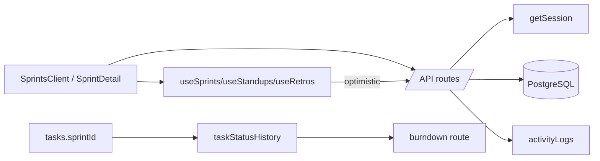

# Plan: Agile Tools Phase — Sprints, Standup, Retro, Planning (full-stack)

## Context
`ROADMAP.md` / `TODO.md` currently describe Agile **as ceremony conventions only** (sprints/retro/standup live in `TODO.md` prose; phases vs sprints in `ROADMAP.md`). No schema, API, hooks, or UI exist for them. This phase ships four real, full-stack features: **Sprints+board+burndown**, **Daily standup**, **Sprint retro**, **Sprint planning** — matching existing project conventions (Drizzle schema, REST route handlers, optimistic React Query hooks, Tailwind client UI, activity logging).

Existing patterns to mirror:
- Schema: `src/db/schema.ts` (Drizzle pg-core, uuid PKs, enums, `createdAt`/`updatedAt`)
- API: `src/app/api/projects/[id]/milestones/route.ts` + `src/app/api/milestones/[id]/route.ts` (GET/POST/PATCH/DELETE + `activityLogs`)
- Hooks: `src/hooks/useMilestones.ts` (optimistic `onMutate`/`onError`/`onSettled`)
- Nav: `src/components/Sidebar.tsx` (`navItems` array)
- Data flow stays server-component fetch → API route → `getSession()` → Drizzle → JSON.

## 1. Schema (`src/db/schema.ts`)
Add:
- `sprints` table: `id` uuid PK, `projectId` FK→projects (cascade) notNull, `name` text notNull, `goal` text, `startDate`, `endDate` timestamp, `status` text default `"planned"` (`planned`|`active`|`completed`), `createdAt`, `updatedAt`.
- `standups` table: `id` uuid PK, `userId` FK→users (cascade) notNull, `sprintId` FK→sprints (set null), `date` timestamp (day), `yesterday` text, `today` text, `blockers` text, `createdAt`.
- `retroItems` table: `id` uuid PK, `sprintId` FK→sprints (cascade) notNull, `authorId` FK→users (set null), `category` text (`went_well`|`went_wrong`|`action_item`), `content` text notNull, `createdAt`.
- `taskStatusHistory` table: `id` uuid PK, `taskId` FK→tasks (cascade) notNull, `sprintId` FK→sprints (set null), `status` taskStatusEnum notNull, `changedAt` timestamp defaultNow. Powers real burndown.
- Extend `tasks`: add `sprintId` FK→sprints (set null) + `estimate` integer nullable (story points for velocity/burndown weighting).

Then: `deno task db:generate` + `deno task db:push` (and update `src/db/seed.ts` + `bootstrap.ts` with a sample sprint + standup + retro so UI is demoable).

## 2. API Routes (REST, mirror milestone pattern + `activityLogs`)
- `src/app/api/sprints/route.ts` — `GET` (filter `?projectId`), `POST` (create; on create, optionally flip prior `active`→`planned`).
- `src/app/api/sprints/[id]/route.ts` — `GET`, `PATCH` (name/goal/dates/status; setting `status:"active"` deactivates other sprints in project), `DELETE`.
- `src/app/api/tasks/[id]/route.ts` — extend existing `PATCH` to accept `sprintId` and `estimate`; on status change, insert `taskStatusHistory` row (reuse for burndown).
- `src/app/api/standups/route.ts` — `GET` (`?userId&?date&?sprintId`), `POST` (upsert today's standup per user; `activityLogs` `created_standup`).
- `src/app/api/retros/route.ts` — `GET` (`?sprintId`), `POST` (create `retroItems`).
- `src/app/api/retros/[id]/route.ts` — `PATCH`, `DELETE`.
- `src/app/api/sprints/[id]/burndown/route.ts` — `GET` returns ideal vs actual remaining points per day (from `taskStatusHistory` + `estimate`).

## 3. Hooks (`src/hooks/`)
- `src/hooks/useSprints.ts` — `useCreateSprint`, `useUpdateSprint`, `useDeleteSprint` (optimistic, mirror `useMilestones.ts`).
- `src/hooks/useStandups.ts` — `useCreateStandup` (query key `["standups", userId|date]`).
- `src/hooks/useRetros.ts` — `useCreateRetroItem`, `useDeleteRetroItem`.
- Extend `src/hooks/useTasks.ts` `useUpdateTask` input to include `sprintId`/`estimate`.

## 4. UI
- **Sidebar** (`src/components/Sidebar.tsx`): add `{ href: "/dashboard/sprints", label: "Sprints", icon: Timer }`.
- **Sprints list** `src/app/dashboard/sprints/page.tsx` (server) + `SprintsClient.tsx` (client): per-project sprint list, create sprint, set active, link to detail.
- **Sprint detail** `src/app/dashboard/sprints/[id]/page.tsx`: sprint board (reuse Kanban component filtered by `sprintId`), **burndown chart** (`recharts` — add dep to `package.json`), **planning panel** (pull top-priority backlog tasks into sprint), **standup feed** (today's standup form + history), **retro panel** (went well / went wrong / action items CRUD).
- Standup + retro can live as panels in sprint detail to keep nav flat.

## 5. Docs (required by `AGENTS.md` checklist)
- `TODO.md`: mark new items done as built; add agile feature tasks under Priority buckets.
- `STRUCTURE.md`: new tables, routes, hooks, pages; update API route table + Hooks table.
- `ROADMAP.md`: add new phase (e.g. "Phase 2.5 — Agile Tools") + coverage row. Add `recharts` to dependency notes if desired.

## Acceptance
- Create sprint, set active, assign tasks (sprintId), see them on sprint board.
- Burndown renders ideal vs actual from `taskStatusHistory`.
- Submit daily standup (upsert per day); view team feed.
- Submit retro items per sprint; persisted + listed.
- All mutations optimistic with rollback toast; activity logged.
- `deno task lint` + `deno task typecheck` + `deno task build` pass.

## Dependency
- Add `recharts` to `package.json` (charts). `clsx` already present.

## Diagram
