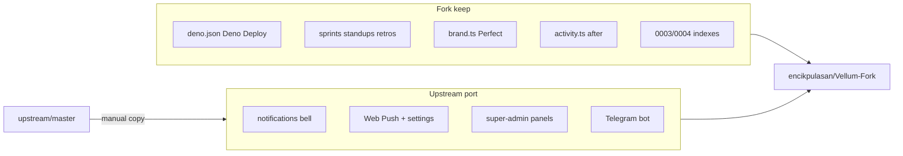

# Port Upstream Features into Vellum-Fork

## Divergence snapshot

Repos diverge hard. **Do not `git merge upstream/master`.** Cherry-pick / copy paths only.

| Area | Upstream ([AxissXs/Vellum](https://github.com/AxissXs/Vellum)) | Fork ([encikpulasan/Vellum-Fork](https://github.com/encikpulasan/Vellum-Fork)) |
|------|------|------|
| Runtime | bun + Vercel + `@vercel/analytics` | **deno tasks + Deno Deploy + Prisma Postgres** |
| Agile | none | **sprints / standups / retros / burndown / backlog** |
| Notifications | bell + push + Telegram done | TODO open (high/medium) |
| Super-admin | Parts 1–7 mostly done | Parts 1–2 done; 3–7 open in [TODO.md](TODO.md) |
| Migrations | `0003`–`0005` = ip / notif / telegram | `0003` = sprints, `0004` = indexes — **number clash** |

**Never overwrite:** [`deno.json`](deno.json), [`migrate.ts`](migrate.ts), [`src/instrumentation.ts`](src/instrumentation.ts), [`src/lib/brand.ts`](src/lib/brand.ts), [`src/lib/activity.ts`](src/lib/activity.ts), sprint APIs/hooks/pages, fork drizzle `0000`–`0004`.

**Port source:** `upstream/master` only. Feature branches (`feat/notifications-bell`, `feat/push-notifications*`) are stale/merged.

---

## Migration strategy (critical)

Fork already owns `0003`/`0004`. Upstream used those numbers for other SQL.

1. Edit [`src/db/schema.ts`](src/db/schema.ts) additively (keep all sprint tables).
2. Run `deno task db:generate` → new tags start at **`0005_*`** (and later).
3. Apply with `deno task db:migrate` (or `db:push` locally).
4. Do **not** copy upstream `drizzle/0003_*.sql` / `0004_*.sql` / `0005_melodic_puck.sql` by filename.

Additive schema targets (from upstream):

- Enum `notification_event_type`
- Tables: `notifications`, `push_subscriptions`, `notification_preferences` (+ later `telegram_pairing_codes`, `platform_settings`)
- Columns: `activity_logs.ip_address`; later `users.telegram_*`, prefs `telegram_enabled`

---

## Wave 1 — In-app notifications bell (TODO high)

Closes [TODO.md](TODO.md) **Notifications bell**.

**Port from upstream:**

- Schema: notifications + prefs (prefs needed for in-app toggles; push columns can exist unused until Wave 2)
- API: [`/api/notifications`](https://github.com/AxissXs/Vellum/tree/master/src/app/api/notifications), `[id]`, `mark-all-read`
- Lib: `src/lib/notifications.ts` — start with `sendInAppNotification` / preference checks; stub or no-op push/telegram until later waves
- Hooks: `useNotifications.ts`
- UI: `NotificationBell.tsx` into dashboard top bar ([`ClientLayout.tsx`](src/app/dashboard/ClientLayout.tsx) / [`Sidebar.tsx`](src/components/Sidebar.tsx) — match upstream top-bar placement)
- Triggers: call notify from task assign/status + comment create in [`src/app/api/tasks`](src/app/api/tasks) and [`src/app/api/comments`](src/app/api/comments), alongside existing `logActivity()` — do not replace activity logging
- Realtime: Pusher `user-{id}` `notification` event (fork already has Pusher)

**Docs:** mark bell done in TODO; add routes/tables/hooks to STRUCTURE.

---

## Wave 2 — Web Push + settings (TODO medium)

Closes **Push notifications** + user settings surface.

**Port:**

- Dep: `web-push` + `@types/web-push` in [`package.json`](package.json) (via `deno install`, **not** bun.lock)
- Lib: `src/lib/push.ts`; extend `sendNotification` pipeline
- API: `/api/push/subscribe`, `/api/push/preferences`
- UI: `PushNotificationToggle`, `ui/Switch`, [`/dashboard/settings`](https://github.com/AxissXs/Vellum/blob/master/src/app/dashboard/settings/page.tsx)
- Asset: `public/sw.js` — smoke-test under Deno Deploy static serving
- Env (Deno Deploy + `.env.example`): `NEXT_PUBLIC_VAPID_PUBLIC_KEY`, `VAPID_PRIVATE_KEY`, `VAPID_SUBJECT`

Wire `sendNotification` so one call does in-app + push (Telegram still no-op or gated off).

---

## Wave 3 — Super-admin Parts 3–7 (TODO low, already scoped)

Fork already has route + users panel. Port remaining panels from upstream `src/app/dashboard/super-admin/*` and `/api/super-admin/*`:

| Part | Port |
|------|------|
| 3 Activity | `SuperAdminActivityPanel` + `/api/super-admin/activity` |
| 4 Sessions | sessions list/revoke APIs + panel |
| 5 Audit | `activity_logs.ipAddress` + audit/export APIs + panel; keep fork `logActivity` — extend to capture IP where login/mutations already have request context |
| 6 Health | health panel + API (reuse/extend fork [`/api/health`](src/app/api/health/route.ts) patterns) |
| 7 Roles matrix | read-only matrix + `/permissions` (static role map; **do not** import upstream’s unfinished dynamic roles redesign) |

Skip upstream bun CI migration workflow (`.github/workflows/apply-migrations.yml`) unless you later want a Deno-compatible equivalent.

---

## Wave 4 — Telegram (enhancement; not yet in fork TODO)

Upstream’s unified pipeline already calls Telegram from `sendNotification`. Port last:

- Schema: pairing codes, platform_settings, user telegram columns, prefs flag
- Lib: `src/lib/telegram.ts`
- APIs: `/api/telegram/*` + `/api/super-admin/telegram/*`
- UI: settings pairing + `SuperAdminTelegramPanel`
- Ops: bot token in `platform_settings` / env; webhook URL must work on Deno Deploy Node runtime (same as other API routes — no `runtime = "edge"`)

Add TODO item when starting this wave.

---

## Explicit non-goals (this port)

- bun.lock, `vercel:*` scripts, `@vercel/analytics`, Neon `DIRECT_DATABASE_URL`
- Soft delete / custom kanban columns / dynamic roles (upstream TODO only; planning docs on `feat/todo-task-planning`)
- File attachments, search, dark mode (neither repo implemented)
- Replacing sprint feature set or brand layer

---

## Implementation workflow (each wave)

1. `git checkout master && git pull` → branch `feat/port-notifications` (then `feat/port-web-push`, etc.)
2. `git fetch upstream` for reference; copy files manually / `git show upstream/master:path > path`
3. Adapt imports: keep `@/` aliases; strip Vercel-only bits; keep brand/sidebar patterns
4. Schema edit → `deno task db:generate` → migrate
5. `deno task lint && deno task typecheck && deno task build`
6. Update [TODO.md](TODO.md) + [STRUCTURE.md](STRUCTURE.md) (+ [AGENTS.md](AGENTS.md) env/route tables if needed)
7. PR per wave (reviewable; avoids mega-merge)

---

## Suggested first PR scope (Wave 1 only)

Smallest valuable close of fork high-priority TODO:

- Additive migration `0005_*` for notification enum + `notifications` (+ prefs if needed for defaults)
- `notifications` API + `NotificationBell` + hooks
- Triggers on task assign / status change / new comment
- Pusher badge updates
- Docs tick in TODO/STRUCTURE

Push, super-admin remainder, Telegram follow as separate PRs using the same playbook.
