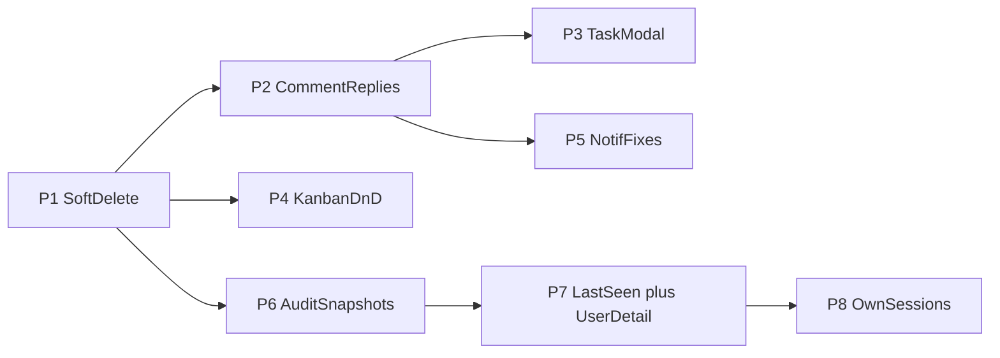

# Port Upstream High + Medium (no keyboard)

Source: [AxissXs/Vellum](https://github.com/AxissXs/Vellum) `upstream/master`. Target: fork `master` via feature branch `feat/port-upstream-high-medium`.

**Method:** Manual port / selective cherry-pick. Regenerate Drizzle migrations as fork `0008+` (do **not** copy upstream migration filenames — fork already used `0006`/`0007`). Keep Perfect brand, Deno Deploy, Telegram NL/LLM, calendar.

**Excluded:** Keyboard shortcuts (`984da26` and shortcut bits inside task-modal commit). Impersonation. Telegram `/bindtopic`. App versioning. Enhanced toasts (already covered enough).

---

## Phase 1 — Soft-delete + trash (HIGH)

Upstream: `7573003`, fixes `f882cc4`, `8f7b961`.

- Schema: add `deletedAt` / `deletedBy` on tasks, projects, comments, teams, teamMembers, projectMilestones, projectNotes (match upstream).
- Fork-only tables (`schedule_events`, telegram_*): **leave hard-delete** this pass.
- Convert DELETE handlers to soft-update; filter reads with `isNull(deletedAt)`.
- New APIs: [`/api/super-admin/trash`](src/app/api/super-admin/trash/route.ts), [`/api/super-admin/restore`](src/app/api/super-admin/restore/route.ts).
- UI: [`SuperAdminTrashPanel.tsx`](src/app/dashboard/super-admin/SuperAdminTrashPanel.tsx) + tab in [`SuperAdminClient.tsx`](src/app/dashboard/super-admin/SuperAdminClient.tsx).
- Kanban optimistic remove on delete (`8f7b961` bits in both boards).
- Generate migration via `deno task db:generate` → apply local with `db:migrate` / `db:push`.
- After soft-delete: Telegram bot task delete paths (if any) must soft-delete or hide deleted rows.

**Conflict hotspots:** every list/GET route, [`stats`](src/app/api/stats/route.ts), dashboard server pages, kanban boards.

---

## Phase 2 — Threaded comment replies (HIGH)

Upstream: `e0c97e3` (+ schema migrations 0009/0010 upstream → fork `0008`/`0009` after soft-delete).

- Schema: `comments.parentId` (self-FK, 1-level only) + index.
- API: [`comments/route.ts`](src/app/api/comments/route.ts) accept `parentId`; validate parent is top-level; nest replies in response.
- Hooks: [`useComments.ts`](src/hooks/useComments.ts) optimistic reply support.
- UI: reply affordance in [`TaskDetailModal.tsx`](src/app/dashboard/projects/[id]/TaskDetailModal.tsx) (minimal nesting UI now; full layout lands in Phase 3).
- Notifications + Pusher: notify parent author on reply; keep fork `sendNotification` + Telegram DM path.

---

## Phase 3 — Task modal redesign (MEDIUM, strip shortcuts)

Upstream: `c016863`, `05ea774`, `9d9d030`. **Drop** `?`/`n`/Esc help-modal wiring from those diffs.

- Two-column layout, visual selectors, wider modal, unified reply editor, searchable assignee via [`TaskAssigneePopover.tsx`](src/components/TaskAssigneePopover.tsx).
- Port into fork [`TaskDetailModal.tsx`](src/app/dashboard/projects/[id]/TaskDetailModal.tsx) (~464 lines today) carefully — preserve fork-specific links/branding if any.
- Wire boards that open the modal ([`KanbanBoard.tsx`](src/app/dashboard/projects/[id]/KanbanBoard.tsx), [`KanbanBoardClient.tsx`](src/app/dashboard/kanban/KanbanBoardClient.tsx)).

---

## Phase 4 — Kanban DnD lock/lag fix (HIGH)

Upstream: `f9b278e`.

- Functional `setColumns` lookups (no stale closure); `useDroppable` on columns; `columnsRef` sync via `useEffect`.
- Apply identically to both kanban files.
- Do after or with soft-delete kanban delete handling so delete+drag stay consistent.

---

## Phase 5 — Notification fixes (HIGH, selective)

Upstream: `05f4b15`. Fork Telegram pipeline already diverged — **do not** blindly replace broadcast architecture.

Port these pieces only:

1. `notifications.url` column + pass-through in [`notifications.ts`](src/lib/notifications.ts) / APIs / hooks.
2. [`NotificationBell.tsx`](src/components/NotificationBell.tsx) deep-link on click + ExternalLink affordance.
3. Task create/PATCH **no-op guards** (status/assignee unchanged → no notif) in [`tasks/[id]/route.ts`](src/app/api/tasks/[id]/route.ts) and [`tasks/route.ts`](src/app/api/tasks/route.ts).
4. Status-change fallback to creator when no assignee.

Keep fork’s existing `broadcastEvent` / supergroup/channel separation if already correct; only align with upstream where fork still double-fires.

---

## Phase 6 — Audit tags / severity / snapshots (MEDIUM)

Upstream: `872e2e0`.

- Schema: `activity_logs.tag`, `activity_logs.severity`; table `activity_log_snapshots`.
- Expand fork [`audit.ts`](src/lib/audit.ts) (today IP-only) with upstream `writeActivityLog` / classify / snapshot helpers — **integrate** with existing [`activity.ts`](src/lib/activity.ts) `logActivity` + `after()` pattern (do not block responses).
- APIs: [`audit/[id]`](src/app/api/super-admin/audit/[id]/route.ts), filter + export columns.
- UI: [`AuditLogDetailModal.tsx`](src/app/dashboard/super-admin/AuditLogDetailModal.tsx) + filters on [`SuperAdminAuditPanel.tsx`](src/app/dashboard/super-admin/SuperAdminAuditPanel.tsx).

---

## Phase 7 — Last-seen + user detail modal (MEDIUM)

Upstream: `7d07aa8`, `e8d9798`.

- Schema: `users.lastSeenAt`, `users.lastSeenIp`.
- New [`last-seen.ts`](src/lib/last-seen.ts); call from [`getSession()`](src/lib/auth.ts) throttled fire-and-forget.
- **No impersonation** in fork → omit impersonator-cookie skip (or leave inert constant `false`).
- Port [`UserDetailModal.tsx`](src/app/dashboard/super-admin/UserDetailModal.tsx) + wire [`SuperAdminUsersPanel.tsx`](src/app/dashboard/super-admin/SuperAdminUsersPanel.tsx); expose last-seen on super-admin users APIs.

---

## Phase 8 — Own session view/revoke (MEDIUM)

Upstream: `2a3cad7`.

- APIs: [`/api/sessions/me`](src/app/api/sessions/me/route.ts), [`/api/sessions/me/[id]`](src/app/api/sessions/me/[id]/route.ts) (self only).
- Hook: [`useSessions.ts`](src/hooks/useSessions.ts).
- UI section on [`settings/page.tsx`](src/app/dashboard/settings/page.tsx).
- Keep existing super-admin session revoke untouched.

---

## Workflow + verify

1. `git checkout master && git pull && git checkout -b feat/port-upstream-high-medium`
2. Implement phases in order (schema-heavy first).
3. Per phase: `deno task db:generate` when schema changes; local migrate; smoke UI.
4. End: `deno task lint`, `typecheck`, `build`.
5. Update [`TODO.md`](TODO.md), [`STRUCTURE.md`](STRUCTURE.md), [`AGENTS.md`](AGENTS.md) per agent checklist.
6. Commit(s) conventional; push branch (no direct master).

## Explicit non-goals

- Keyboard shortcuts / help modal
- Full `git merge upstream/master`
- Copying upstream `drizzle/0006+` files verbatim
- Soft-delete on `schedule_events` / telegram tables (follow-up)
- Impersonation, versioning UI, toast overhaul, Telegram topic binding
