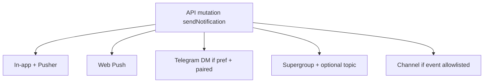

# Port Upstream Telegram (Group/Channel + Webhook)

## Upstream vs fork (gap)

Source: [AxissXs/Vellum](https://github.com/AxissXs/Vellum) `master` — see `TODO/telegram-bot-integration.md` (marked complete) and [`src/lib/telegram.ts`](https://github.com/AxissXs/Vellum/blob/master/src/lib/telegram.ts).

| Capability | Upstream | Fork today |
|------------|----------|------------|
| User pairing + DM prefs | Yes | Yes |
| Comment mentions → notify | (assumed via `sendNotification`) | Fixed recently |
| Supergroup post per event + forum topics | Yes (`broadcastToSupergroup(eventType, text)`) | Helpers exist; **not called**; no topic mapping |
| Channel post for selected events | Yes (`maybeBroadcastToChannel`) | **Not wired** |
| Auto `setWebhook` + `secret_token` | Yes | Manual curl only |
| Webhook verifies secret header | Yes | **No** |
| Create forum topic API | `/api/super-admin/telegram/topics` | **Missing** |
| Public bot-configured check | `/api/telegram/config` | **Missing** |
| Per-event HTML templates | Yes | **Missing** |
| Admin UI: topics / channel events / templates / webhook URL | Full panel | Token + IDs + setup guide only |



**Approach:** Match upstream behavior for group/channel (post on each `sendNotification`, topic by event type, channel only for selected events). Adapt env/branding for Deno + Perfect.

## Implementation

### 1. Expand [`src/lib/telegram.ts`](src/lib/telegram.ts)

Keep using [`src/lib/platform-settings.ts`](src/lib/platform-settings.ts) (do not re-embed DB helpers like upstream).

Port from upstream:

- `TELEGRAM_EVENT_TYPES` — include fork’s `schedule_assigned` plus upstream six types
- Topic/channel/template helpers: `getTelegramTopicMapping`, `getChannelEvents` / `setChannelEvents`, `getTelegramTemplate` / `setTelegramTemplate`, `getDefaultTemplate`, interpolate + escape
- `getWebhookSecretToken` / `getWebhookUrl` / `setTelegramWebhook` with `secret_token`
- `telegramApi` optional token override (for test-before-save)
- Update `sendTelegramNotification` to use templates + “Open in Perfect” link
- Update `broadcastToSupergroup(eventType, text)` to use topic mapping + `message_thread_id`
- Add `maybeBroadcastToChannel(eventType, title, content, url?)`

**Webhook URL resolution (Deno, not Vercel):**

1. `process.env.NEXT_PUBLIC_APP_URL` (document in `.env.example` / AGENTS)
2. Else `process.env.APP_URL` if set
3. Admin PATCH may also pass `webhookUrl` from `window.location.origin` so Deploy works without env

### 2. Wire pipeline in [`src/lib/notifications.ts`](src/lib/notifications.ts)

After DM (same as upstream):

```ts
await sendTelegramNotification(...);
await broadcastToSupergroup(type, `${title}\n\n${content}`); // no-op if no supergroup id
await maybeBroadcastToChannel(type, title, content, url);
```

Swallow/log Telegram API failures so one channel failure does not break the request.

### 3. API routes

| Route | Action |
|-------|--------|
| [`src/app/api/telegram/webhook/route.ts`](src/app/api/telegram/webhook/route.ts) | Verify `X-Telegram-Bot-Api-Secret-Token`; keep Perfect copy in replies |
| New `src/app/api/telegram/config/route.ts` | `GET` `{ configured: boolean }` (no auth) — for settings bot-name hints |
| Expand [`src/app/api/super-admin/telegram/settings/route.ts`](src/app/api/super-admin/telegram/settings/route.ts) | Return/PATCH topics, channelEvents, templates, webhookUrl; auto `setWebhook` on token save |
| New `src/app/api/super-admin/telegram/topics/route.ts` | Port `createForumTopic` from upstream |
| Expand test route | Optional token override like upstream |

No schema migration — all new keys live in existing `platform_settings`.

### 4. Admin UI — [`SuperAdminTelegramPanel.tsx`](src/app/dashboard/super-admin/SuperAdminTelegramPanel.tsx)

Port upstream panel structure onto fork’s light theme (do not copy dark slate/Vercel styling wholesale):

- Webhook URL display + copy; save auto-registers webhook
- Supergroup / channel IDs (clarify: used once wired)
- Per-event topic ID + “Create topic”
- Channel event checkboxes
- Per-event HTML templates (`{title}`, `{content}`, `{url}`)
- Keep existing Setup guide; trim manual-curl emphasis once auto-webhook works

### 5. Settings UX tweaks

- Optional: fetch `/api/telegram/config` to show whether bot is configured before pairing
- Guide copy: DMs = prefs; group/channel = admin-configured broadcasts (not personal toggles)

### 6. Docs

Update [`AGENTS.md`](AGENTS.md) API table, [`STRUCTURE.md`](STRUCTURE.md), `.env.example` (`NEXT_PUBLIC_APP_URL`), Telegram setup guide text.

## Out of scope

- Merging upstream git / bun / Vercel
- Changing mention parser ([`src/lib/mentions.ts`](src/lib/mentions.ts)) beyond current behavior
- Deduplicating group posts when many users notified in one action (upstream also posts once per `sendNotification` call)

## Verify

1. Save token → webhook auto-set; `getWebhookInfo` shows secret-protected URL
2. Pair user → DM on `comment_mention` / `new_comment` with prefs on
3. Set supergroup + topic for an event → group gets posts in that topic
4. Enable channel event → channel posts; disabled events skip channel
5. Invalid webhook secret → 401
6. `deno task lint` / `typecheck` / `build`
