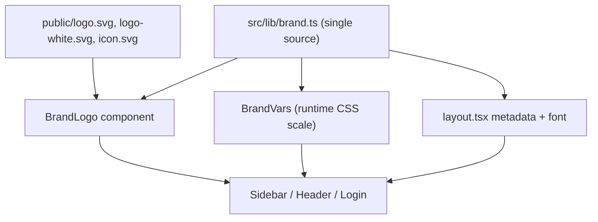

# Rebrand Vellum → Perfect (whitelabel-ready)

Principle: **one brand source of truth**, zero scattered literals. Future rebrand = edit `src/lib/brand.ts` (or env), not grep-replace the codebase.

Source assets from https://perfect.my/:
- `logo.svg` (blue `#0052cc` wordmark, viewBox `0 0 374.01 112.18`, ~3.34:1), `logo-white.svg` (white variant)
- Brand color `#0052cc`, accents `#2979e8`/`#0044aa`/`#003d99`, dark base `#030712`/`#111827`
- Font: **Open Sans**

## 1. Brand config — `src/lib/brand.ts` (NEW)
Single module. Every other file imports from here; nothing hardcodes "Perfect" or the color.

```ts
export interface BrandConfig {
  name: string;
  displayName: string;
  tagline: string;
  emailDomain: string;
  logo: { light: string; dark: string }; // light=on-light-bg, dark=on-dark-bg(white)
  primaryColor: string;
  fontVar: string;
}

// Defaults = Perfect. Override per-tenant via NEXT_PUBLIC_BRAND_* or a JSON file later.
const env = process.env;
export const brand: BrandConfig = {
  name: env.NEXT_PUBLIC_BRAND_NAME ?? "Perfect",
  displayName: env.NEXT_PUBLIC_BRAND_DISPLAY ?? "Perfect",
  tagline: env.NEXT_PUBLIC_BRAND_TAGLINE ?? "Team management, simplified.",
  emailDomain: env.NEXT_PUBLIC_BRAND_EMAIL_DOMAIN ?? "perfect.my",
  logo: {
    light: env.NEXT_PUBLIC_BRAND_LOGO_LIGHT ?? "/logo.svg",
    dark: env.NEXT_PUBLIC_BRAND_LOGO_DARK ?? "/logo-white.svg",
  },
  primaryColor: env.NEXT_PUBLIC_BRAND_COLOR ?? "#0052cc",
  fontVar: "var(--font-open-sans)",
};
```

## 2. Brand logo component — `src/components/BrandLogo.tsx` (NEW)
Replaces the 3 duplicated inline 4-square SVGs. Picks variant by background.

```tsx
"use client";
import { brand } from "@/lib/brand";
export function BrandLogo({ variant = "dark", className }: { variant?: "light" | "dark"; className?: string }) {
  return (
    
  );
}
```
- `src/components/Sidebar.tsx:109-113` → `<BrandLogo variant="dark" className="h-6 w-auto" />` (drop colored square).
- `src/app/dashboard/ClientLayout.tsx:57-61` → `<BrandLogo variant="dark" className="h-5 w-auto" />`.
- `src/components/LoginForm.tsx:58-62` → `<BrandLogo variant="light" className="h-9 w-auto" />` on the dark gradient.

## 3. Runtime brand color — decouple from `@theme`
`globals.css` keeps a **default** blue scale in `@theme` (so utilities like `bg-brand-500` exist at build). A small client component injects the actual scale from `brand.primaryColor` onto `:root` at runtime, overriding the default — so the color is driven by config, not the CSS file.

- `src/components/BrandVars.tsx` (NEW, `"use client"`): generates 50–900 scale from `brand.primaryColor` and `document.documentElement.style.setProperty("--color-brand-XXX", …)`. No-op when value equals default (no flash).
- Mount `<BrandVars />` in `src/app/layout.tsx` (or `globals.css` includes the Perfect default so first paint is already correct).
- `globals.css:18` scrollbar `#cbd5e1` → brand slate; `layout.tsx:20` `bg-slate-950` → `bg-[#060b1a]`.

## 4. Font — `src/app/layout.tsx`
Load Open Sans via `next/font/google`, expose `--font-open-sans`, apply on `<body>`. `brand.fontVar` references it; swap font later by changing one var. Set metadata title from `brand.displayName`:

```ts
export const metadata: Metadata = {
  title: `${brand.displayName} — Team Management`,
  description: brand.tagline,
  icons: { icon: "/icon.svg" },
};
```

## 5. Product name text → config
Replace literals with `brand.*`:
- `src/components/Sidebar.tsx:115` `<span>Vellum</span>` → `brand.name`
- `src/app/dashboard/ClientLayout.tsx:62` `Vellum` → `brand.name`
- `src/components/LoginForm.tsx:63` `<h1>Vellum</h1>` → `brand.displayName`; line 64 tagline → `brand.tagline`
- `src/app/setup/page.tsx:84,101` "Welcome to Vellum" → `Welcome to {brand.displayName}`

## 6. Assets — `public/`
- `public/logo.svg` = blue wordmark (from `/tmp/plogo.svg`, strip c2pa `<metadata>`/`<defs>`, keep `<svg viewBox="0 0 374.01 112.18"><path fill="#0052cc" …/></svg>`).
- `public/logo-white.svg` = white wordmark (from `/tmp/plogo_white.svg`).
- `public/icon.svg` = favicon (blue rounded square w/ white "P", or wordmark) — referenced by metadata.

## 7. Consistency
- `src/db/seed.ts` / `src/db/bootstrap.ts`: emails `@vellum.app` → `@{brand.emailDomain}` (i.e. `perfect.my`); "Vellum Platform" → `${brand.name} Platform`.
- `package.json:2` name `vellum`→`perfect`.
- `deno.json:25` `app:"vellum"` deploy slug — **leave as-is unless you want the Deploy name changed** (ask).
- Docs (`README.md`, `AGENTS.md`, `STRUCTURE.md`, `TODO.md`, `CONTRIBUTIONS.md`, `ROADMAP.md`): reference brand module, not literal.

## Verify
`deno task lint` · `deno task typecheck` · `deno task build`. Manual: login, sidebar, header, setup show blue + Open Sans + Perfect wordmark; confirm no remaining `Vellum` literals in `src/`.

### Architecture

