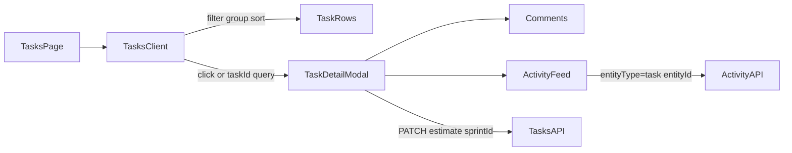

# Tasks page revamp

## Scope

Surface: [`src/app/dashboard/tasks/page.tsx`](src/app/dashboard/tasks/page.tsx) only (not Kanban redesign). Shared pieces touched because list must open full detail: [`TaskDetailModal.tsx`](src/app/dashboard/projects/[id]/TaskDetailModal.tsx), activity API `entityId`, notif/activity deep-link URLs.

## Architecture

## 1. Rewrite tasks list as client work queue

Split page:

- Server [`page.tsx`](src/app/dashboard/tasks/page.tsx): session + initial data (tasks with project/assignee/estimate/sprintId/dueDate, users list, projects list) → pass to client.
- New [`TasksClient.tsx`](src/app/dashboard/tasks/TasksClient.tsx): interactive UI.

**Toolbar (client filters, mirror Kanban/Activity patterns):**

- Search `q` on title
- Selects: status, priority, project, assignee (`Me` / user / Unassigned)
- Sort: dueDate | priority | updatedAt | title
- Scope toggle: My tasks | All (replace dual duplicate lists)

**Due groups (default view):** Overdue → Today → This week → Later → No due. Hide empty groups. Within group apply sort.

**Row:** title, status, priority, project chip, assignee, due, estimate pts. Click → open modal + `router.replace(?taskId=id)`.

**Deep link:** on mount read `searchParams.taskId`; if task in list open modal; if missing fetch `GET /api/tasks/:id` then open. Close clears `taskId` from URL. Fixes existing links in [`activity-ui.ts`](src/lib/activity-ui.ts) / audit.

## 2. Open + deepen TaskDetailModal

Reuse modal from list (same props pattern as Kanban). Extend local `Task` type + form with:

- **Estimate** — number input (pts)
- **Sprint** — `<select>` from `GET /api/sprints?projectId=` (Backlog pattern); add thin `useSprints(projectId)` query if missing

Include `estimate` / `sprintId` in PATCH body (API already accepts; use `useUpdateTask` or extend existing fetch). Gate sprint change with `edit_sprints` like API.

List `onChange` / `onDelete` update client task cache so row reflects edits without full reload.

## 3. Real activity history in modal

Today right pane = comments labeled “Activity”.

- Add `entityId` query param to [`/api/activity`](src/app/api/activity/route.ts) + [`useActivity`](src/hooks/useActivity.ts).
- Modal right column: tabs **Comments** | **History**. History = activity rows for that task (`entityType=task&entityId=`). Reuse activity row presentation from ActivityClient where cheap.

## 4. Align deep-link URLs

Point task-related notification URLs at `/dashboard/tasks?taskId=${id}` (assign/status/create/comment in notif helpers) so bell → opens task on revamped page. Activity/audit already use this form.

## 5. Docs

Update [`STRUCTURE.md`](STRUCTURE.md) tasks page entry + TaskDetailModal fields; mark related items in [`TODO.md`](TODO.md) if search/filters partially covered.

## Out of scope

Attachments, time tracking, dependencies, Kanban `?taskId=` (list page owns deep link), keyboard shortcuts, dedicated `/tasks/[id]` route.

## Verify

`deno task lint` + `deno task typecheck`. Manual: filter/group, `?taskId=` open/close, edit estimate/sprint, History tab shows logs.