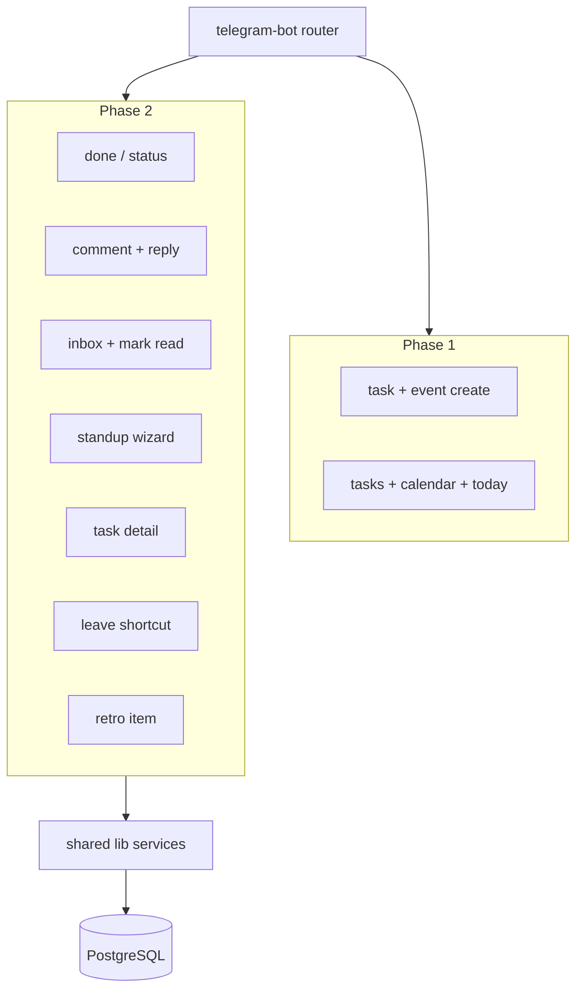

# Telegram Bot — Tasks & Calendar (Phase 1 + Phase 2)

## Current state

Telegram is **outbound-only** today:

- Webhook ([`src/app/api/telegram/webhook/route.ts`](src/app/api/telegram/webhook/route.ts)) — `/start` pairing only.
- `allowed_updates: ["message"]` only ([`src/lib/telegram.ts`](src/lib/telegram.ts)).
- Relevant REST APIs already exist for all planned bot actions (see Phase 2 mapping below).

## Phasing

| Phase | Focus | Ship when |
|-------|--------|-----------|
| **Phase 1** | Create + view tasks/calendar | Core bot infra + highest daily value |
| **Phase 2** | Quick actions on existing entities | After Phase 1 verified |

---

## Phase 1 — Create + View

### Commands

**Create**

| Command | Behavior |
|---------|----------|
| `/help` | All commands + examples (app TZ) |
| `/cancel` | Abort wizard |
| `/task` | Wizard: title → project → optional assignee → confirm |
| `/task Project \| Title` | One-shot when project unique |
| `/event` | Wizard: title → start → end → type → optional assignee → confirm |
| `/event Title \| start \| end` | One-shot |
| `/start` | Pairing (unchanged) |

**View**

| Command | Behavior |
|---------|----------|
| `/tasks` | Open tasks assigned to me (≠ done), 10/page |
| `/tasks today` / `week` | Due-date filters |
| `/tasks project <name>` | Filter by project |
| `/tasks @user` | Admin: another user's tasks |
| `/calendar today` / `tomorrow` / `week` | My schedule events |
| `/calendar team` | Team schedules (7 days); admin sees private |
| `/today` | Digest: events + due tasks + leave conflicts |

Pagination via inline Next/Prev (`callback_query`, no DB session).

### Phase 1 services

| Module | Used by |
|--------|---------|
| [`src/lib/create-task.ts`](src/lib/create-task.ts) | POST `/api/tasks`, bot create |
| [`src/lib/create-schedule.ts`](src/lib/create-schedule.ts) | POST `/api/schedules`, bot create |
| [`src/lib/query-tasks.ts`](src/lib/query-tasks.ts) | GET `/api/tasks`, `/tasks` |
| [`src/lib/query-calendar.ts`](src/lib/query-calendar.ts) | GET `/api/calendar`, `/calendar` |
| [`src/lib/telegram-dates.ts`](src/lib/telegram-dates.ts) | All date parsing |

### Phase 1 bot files

[`src/lib/telegram-bot/`](src/lib/telegram-bot/): `index`, `auth`, `sessions`, `commands`, `task-flow`, `event-flow`, `list-tasks`, `list-calendar`, `list-today`, `format`, `keyboards`, `messages`.

---

## Phase 2 — Quick Actions (all selected)

Best fit for Telegram: **short text, high frequency, mobile context**. Each maps to existing API logic.

### 1. Task status — `/done`, `/status`

| Command | Behavior |
|---------|----------|
| `/done <ref>` | Mark task done (`status: done`); `<ref>` = short id prefix or title fuzzy match among **my** open tasks |
| `/status <ref> <status>` | Set status: `todo`, `in_progress`, `review`, `done` |
| Inline from `/tasks` list | Each row gets **Done** / **Start** buttons (`callback: status:taskId:done`) |

- Permission: `edit_tasks` ([`src/app/api/tasks/[id]/route.ts`](src/app/api/tasks/[id]/route.ts) PATCH).
- Reuse extracted [`src/lib/update-task.ts`](src/lib/update-task.ts): status change, `taskStatusHistory`, `broadcastTaskEvent`, `sendNotification` on status/assignee change.
- Ambiguous title match → reply with numbered choices (inline keyboard).

### 2. Comments — `/comment`

| Command | Behavior |
|---------|----------|
| `/comment <ref> \| <text>` | Add comment on task |
| Reply to notification | If user **replies** to a bot notification message containing `entityId`, treat reply body as comment (requires storing `message_id → entity` map in notification send path, or parse link from quoted text) |

- Permission: session user (same as POST [`/api/comments`](src/app/api/comments/route.ts)).
- Reuse [`src/lib/create-comment.ts`](src/lib/create-comment.ts): insert, mentions via [`resolveMentionedUserIds`](src/lib/mentions.ts), Pusher + notifications.
- Supports `@mention` in comment text (existing parser).

### 3. Notifications inbox — `/inbox`

| Command | Behavior |
|---------|----------|
| `/inbox` | Last 10 unread in-app notifications |
| `/inbox all` | Last 10 regardless of read state |
| Inline **Mark read** | Per notification; **Mark all read** button |

- Data: [`/api/notifications`](src/app/api/notifications/route.ts) GET + PATCH + [`mark-all-read`](src/app/api/notifications/mark-all-read/route.ts).
- Read-only for Telegram prefs (use web Settings for channel toggles).
- Optional enhancement: add inline **Open** link using existing `entityType`/`entityId` from notification row.

### 4. Standup — `/standup`

| Command | Behavior |
|---------|----------|
| `/standup` | Wizard: yesterday → today → blockers → confirm (upsert today) |
| `/standup today \| Blocked on API` | One-shot partial update (merge with existing day) |

- Logic from [`src/app/api/standups/route.ts`](src/app/api/standups/route.ts): one standup per user per day, optional `sprintId` (auto-pick active sprint if single match, else ask).
- Session flow: `flow: "standup"` in `telegram_bot_sessions`.
- Permission: any authenticated user (self only).

### 5. Task detail — `/task <ref>`

| Command | Behavior |
|---------|----------|
| `/task <ref>` | Show title, status, priority, due, project, assignee, description snippet, deep link |
| `/task <ref> comments` | Last 5 comments |

- Read via `query-tasks` + GET comments; no create wizard conflict — route by arg count: no args → create wizard; with ref → detail view.
- Permission: `view_tasks`.

### 6. Leave shortcut — `/leave`

| Command | Behavior |
|---------|----------|
| `/leave today` | All-day leave today for self |
| `/leave tomorrow` | All-day leave tomorrow |
| `/leave 2026-07-20 \| 2026-07-22` | Date range, all-day, type `leave`, visibility `team` |

- Wraps `createScheduleForUser` with `type: "leave"`, `allDay: true`.
- Permission: `create_own_schedule`; admin assigning leave for others → `manage_schedules` + assignee step.
- Reply includes conflict warning if leave overlaps due tasks (existing conflict logic).

### 7. Retro — `/retro`

| Command | Behavior |
|---------|----------|
| `/retro` | Pick active sprint (inline list) → category → text |
| `/retro went_well \| Great deploy` | One-shot; category: `went_well`, `went_wrong`, `action_item` |

- Logic from [`src/app/api/retros/route.ts`](src/app/api/retros/route.ts).
- Sprint picker: query sprints where `endDate >= today` (or active status); error if none.
- Permission: any authenticated user.



---

## Shared infrastructure (both phases)

### Schema

```ts
telegram_bot_sessions: {
  id, userId, chatId,
  flow: "task" | "event" | "standup" | "retro",
  step: text,
  payload: text,   // JSON
  expiresAt, updatedAt
}
```

### Telegram API extensions ([`src/lib/telegram.ts`](src/lib/telegram.ts))

- `replyMarkup` on sendMessage
- `answerCallbackQuery`, `editMessageText`
- `allowed_updates: ["message", "callback_query"]`
- Phase 2 optional: when sending DM notifications, append inline keyboard (Mark read, Comment, Done) keyed by `notificationId` / `taskId`

### Webhook ([`src/app/api/telegram/webhook/route.ts`](src/app/api/telegram/webhook/route.ts))

- Pairing unchanged at top
- Route `message` + `callback_query` → `handleTelegramUpdate`
- Handle **reply-to-message** for comment shortcut (Phase 2)

### Security (all phases)

- Private chat only; resolve user by `telegramChatId`
- `hasPermission` on every mutating action
- Wizards: 15 min TTL; `/cancel` clears
- No super-admin, user CRUD, project CRUD, or kanban reorder via bot

### Not suitable for Telegram (explicit out of scope)

- Project/team/sprint/user admin CRUD
- Kanban drag-and-drop / position edits
- File uploads, avatar changes
- Super-admin panel settings
- Natural-language AI parsing
- Group/supergroup create commands (DM only)
- Edit/delete schedules or tasks beyond status (Phase 3 if needed)

---

## Docs

[`src/app/dashboard/settings/page.tsx`](src/app/dashboard/settings/page.tsx) — command reference grouped Phase 1 / Phase 2.

[`AGENTS.md`](AGENTS.md) + [`STRUCTURE.md`](STRUCTURE.md) — bot modules, session table, command table.

---

## Verify

**Phase 1:** create wizard + one-shot; view + pagination; role-aware assign; `/cancel`; lint/typecheck/build.

**Phase 2:**
1. `/done` on listed task → status `done` + Pusher broadcast.
2. `/comment ref | text` → comment visible in web + mention notifications.
3. `/inbox` + mark read inline.
4. `/standup` wizard upserts today; second run merges fields.
5. `/task ref` shows detail; `/task ref comments` lists comments.
6. `/leave tomorrow` creates leave schedule + conflict warning when applicable.
7. `/retro went_well | text` attaches to active sprint.
8. Status inline buttons on `/tasks` list work via callback_query.
