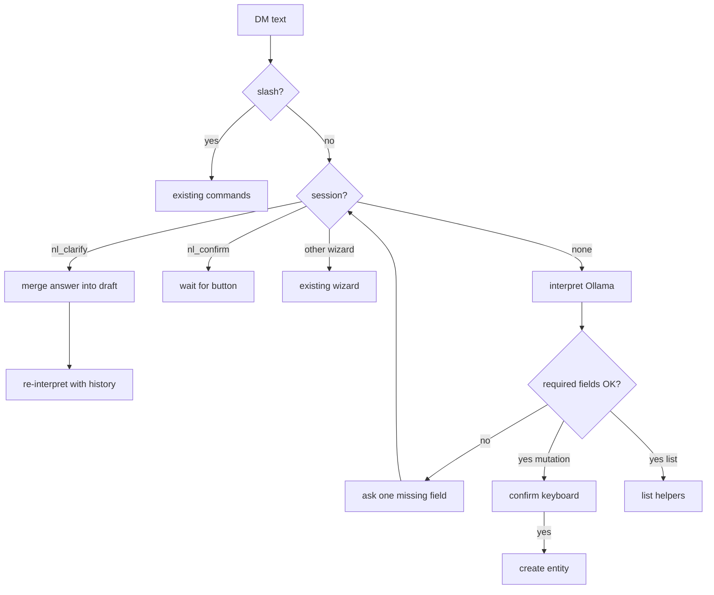

# Telegram NL Interpret (free text + shared JSON + re-ask)

## Scope

- **In:** Plain DM text → Ollama → shared `TelegramInterpretResult` → intent dispatch
- **In:** If any **required field** missing → ask user again (one question at a time) until filled → then confirm → create
- **In:** Handlers for `create_event`, `create_task`, `create_leave`, `list_tasks`, `list_calendar`
- **In:** Slash commands remain shortcuts
- **Out:** Telegram voice notes / STT; auto-create without confirm

## Message routing

In [`src/lib/telegram-bot/index.ts`](src/lib/telegram-bot/index.ts):

1. Wizard session (non-NL) → existing wizards
2. Slash → existing commands
3. NL clarify/confirm session → continue NL flow
4. Else plain text → interpret



## Shared JSON schema

[`src/lib/telegram-interpret/schema.ts`](src/lib/telegram-interpret/schema.ts):

```ts
type TelegramIntent =
  | "create_event"
  | "create_task"
  | "create_leave"
  | "list_tasks"
  | "list_calendar"
  | "standup"
  | "comment"
  | "status"
  | "unknown";

type TelegramInterpretResult = {
  intent: TelegramIntent;
  title: string | null;
  description: string | null;
  startsAt: string | null;
  endsAt: string | null;
  allDay: boolean;
  scheduleType: "work" | "meeting" | "leave" | "training" | "other" | null;
  projectName: string | null;
  priority: "low" | "medium" | "high" | "urgent" | null;
  dueDate: string | null;
  status: "todo" | "in_progress" | "review" | "done" | null;
  listRange: "today" | "tomorrow" | "week" | null;
  confidence: number;
  needsClarification: boolean;
  clarificationQuestion: string | null;
  missingFields: string[];   // e.g. ["startsAt","projectName"]
  raw: string;
};
```

Prompt: never invent missing required values; set `needsClarification`, `missingFields`, and a short `clarificationQuestion` when incomplete. Keep **`think: true`**.

## Required fields (server is source of truth)

[`src/lib/telegram-interpret/required.ts`](src/lib/telegram-interpret/required.ts) — always re-check after LLM (do not trust model alone):

| Intent | Required |
|--------|----------|
| `create_event` | `title`, `startsAt`, `endsAt` |
| `create_leave` | `startsAt`, `endsAt` (default title `"Leave"` if absent) |
| `create_task` | `title`, `projectName` (must resolve to a project) |
| `list_tasks` / `list_calendar` | none beyond intent; default `listRange` to `today` if null |

If LLM marks complete but server finds gaps → still ask. Prefer LLM’s `clarificationQuestion` when it matches a missing field; else generate:

- missing `startsAt` → “When should this start? (e.g. tomorrow 2pm)”
- missing `endsAt` → “How long, or when does it end? (e.g. 1h or 3pm)”
- missing `title` → “What should I call this?”
- missing `projectName` → “Which project?” (+ inline project keyboard if list short)

## Clarify loop

[`src/lib/telegram-bot/nl-flow.ts`](src/lib/telegram-bot/nl-flow.ts):

1. Interpret user text (+ optional prior draft / Q&A turns in session payload)
2. `getMissingFields(result)` — if non-empty:
   - Upsert session `flow: "nl"`, `step: "clarify"`
   - Store `{ draft, missingFields, turns: [{q,a}...] }`
   - Send **one** question for the first missing field
   - Return (do not confirm yet)
3. On next user message while `clarify`:
   - Append answer to turns
   - Re-call Ollama with: original raw + draft JSON + Q&A history + latest answer
   - Loop until no missing fields (cap **5** clarify turns → suggest `/cancel` + structured `/event` syntax)
4. When complete → show confirm summary → `nl:yes` / `nl:no`
5. `/cancel` clears NL session

Ambiguous `projectName` (0 or 2+ matches) counts as missing → ask / keyboard, same loop.

## Client

[`src/lib/telegram-interpret/ollama.ts`](src/lib/telegram-interpret/ollama.ts):

- `LLM_INTERPRET_URL`, `LLM_INTERPRET_MODEL` (`gemma4:e2b`), `LLM_INTERPRET_SECRET`
- `ngrok-skip-browser-warning`, 30s timeout
- Support `interpret(text, { history?, preferredIntent? })`

## Dispatcher after fields complete

| Intent | Action |
|--------|--------|
| `create_event` / `create_leave` | Confirm → `createScheduleForUser` |
| `create_task` | Confirm → `createTaskForUser` |
| `list_*` | List helpers (no confirm) |
| `standup` / `comment` / `status` | Point to slash commands |
| `unknown` | Tip + `/help` |

Permissions same as slash paths.

## Help / Settings

- Natural examples + “bot will ask if something’s missing”
- Phone keyboard dictation tip; no voice notes
- [`AGENTS.md`](AGENTS.md) env vars

## Verify

1. `lunch with Ali tomorrow 1pm` → full fields → confirm → create
2. `dentist next week` → ask for day/time → user answers → ask again if still incomplete → confirm
3. `add task Fix login` (no project) → ask which project → confirm → create
4. `cuti esok` → leave with dates or ask end if needed → confirm
5. After 5 failed clarifies → graceful give-up message
6. Slash `|` one-shot still works without Ollama
7. `deno task typecheck` / `build`
