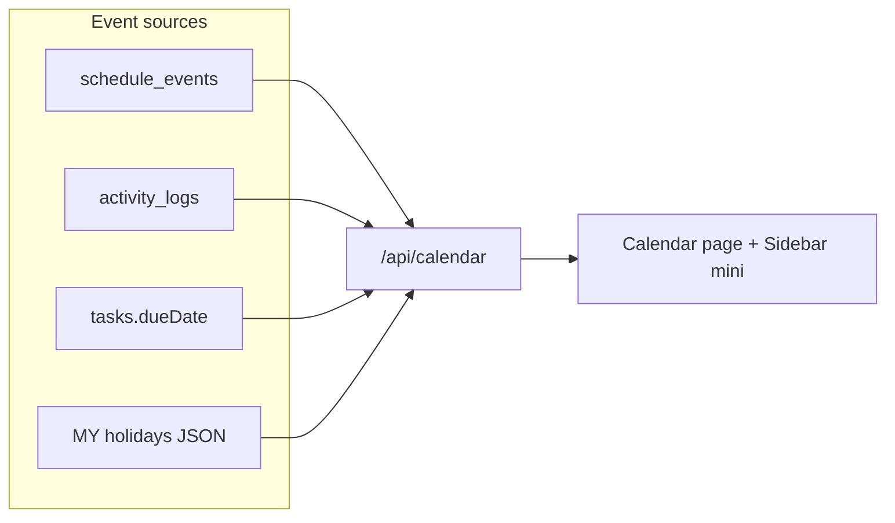

# Daily Activity Calendar + Team Calendar

## Verdict

No calendar today. Activity feed = audit log only ([`activity_logs`](src/db/schema.ts)). TODO already lists “Calendar view - tasks due dates”.

**Ship as one product surface:** `/dashboard/calendar` with layer toggles + Sidebar nav + compact team month widget.

## Data model

New table `schedule_events` in [`src/db/schema.ts`](src/db/schema.ts):

| Column | Purpose |
|--------|---------|
| `id` | uuid PK |
| `userId` | assignee (who calendar shows on) |
| `createdById` | actor (admin may ≠ assignee) |
| `title`, `description` | text |
| `type` | enum: `work` \| `meeting` \| `leave` \| `training` \| `other` |
| `startsAt`, `endsAt` | timestamptz |
| `allDay` | boolean |
| `visibility` | `team` \| `private` (private = self + admins) |
| `projectId` | optional FK |
| `createdAt`, `updatedAt` | |

Indexes: `(userId, startsAt)`, `(startsAt, endsAt)`.

Migration via `deno task db:generate` + commit SQL under `drizzle/`.

## Permissions

Extend [`src/lib/permissions.ts`](src/lib/permissions.ts):

- `view_calendar` — all roles
- `create_own_schedule` — all roles (own `userId` only)
- `manage_schedules` — admin + superadmin (create/edit/delete for any user)

API enforces: member can only mutate own; admin can set `userId` to anyone. Mirror task `assigneeId` pattern.

## APIs

| Route | Methods | Role |
|-------|---------|------|
| `/api/calendar` | GET `?from=&to=&userId=&scope=me\|team&layers=` | auth |
| `/api/schedules` | POST | own or `manage_schedules` |
| `/api/schedules/[id]` | PATCH, DELETE | owner or admin |
| `/api/calendar/holidays` | GET `?year=` | auth (or fold into `/api/calendar`) |

`GET /api/calendar` aggregates:

1. **schedules** in range (team = all non-private + own private; admins see all)
2. **activity** buckets from `activity_logs` (`createdAt` in range, optional `userId`) — read-only overlay
3. **task due dates** for visible assignees (closes existing TODO.md calendar item)
4. **MY holidays** from static module (no DB)

Extend activity query with `from`/`to`/`userId` (reuse super-admin audit filter pattern).

## Malaysia holidays

Static curated data [`src/lib/holidays/malaysia.ts`](src/lib/holidays/malaysia.ts) — **gazetted federal dates by year** (not Hijri math; official dates shift).

Include for each year (seed 2025–2027, easy to extend):

- **Federal:** New Year, Labour Day, Merdeka, Malaysia Day, Agong birthday, Christmas
- **Islamic:** Aidilfitri (2 days), Aidiladha, Awal Muharram, Maulidur Rasul
- **Buddhist:** Wesak
- **Hindu:** Deepavali, Thaipusam
- **Chinese:** Chinese New Year (2 days)
- **Christian (federal where applicable):** Christmas; note Good Friday is state-level — mark as `scope: "state"` optional entries for major states if useful later

Shape: `{ date, name, nameMs?, religion?, type: "public"|"religious"|"observance" }`.

Calendar renders holidays as non-editable all-day chips (distinct color).

## UI

### Full page — [`src/app/dashboard/calendar/`](src/app/dashboard/calendar/)

- Month grid (custom with existing `date-fns`; no new heavy calendar lib)
- Views: **My** | **Team (everyone)**
- Day detail panel: list events / activity / tasks / holidays
- Layer checkboxes: Schedules, Activity, Tasks, Holidays
- Create/edit schedule modal; admin gets **User** select
- Color by user (team view) + type badges

### Sidebar — [`src/components/Sidebar.tsx`](src/components/Sidebar.tsx)

1. Nav item: `{ href: "/dashboard/calendar", label: "Calendar", icon: Calendar }` (after Activity)
2. **Mini month** under nav (collapsed = icon-only dots): shows team schedule density for current month; click day → `/dashboard/calendar?date=YYYY-MM-DD&scope=team`

Match existing Tailwind / no-card-clutter patterns used in dashboard.

### Hooks

`src/hooks/useCalendar.ts`, `useSchedules.ts` — React Query + optimistic create/update/delete (same pattern as comments/tasks).

## Suggested related features (include in v1 vs later)

**In v1 (high value, small cost):**

1. **Leave / OOO type** — already in `type=leave`; show red/amber on team calendar so others plan around absences
2. **Notify assignee** when admin creates schedule for them (reuse notifications + optional push; new event type `schedule_assigned`)
3. **Conflict hint** — warn if leave overlaps task due dates for that user

**Phase 2 (useful, defer):**

4. Recurring schedules (RRULE or simple weekly)
5. iCal / Google export
6. Team busy heatmap (week view density)
7. Link day click → filtered activity feed
8. State-specific MY holidays toggle (Selangor/Sabah/Sarawak extras)
9. Standup completion dots on personal calendar

## Docs / workflow

Per AGENTS.md: feature branch `feat/team-calendar`, update [`TODO.md`](TODO.md) (mark calendar done + add holiday/schedule items), [`STRUCTURE.md`](STRUCTURE.md) (routes, schema, hooks), [`AGENTS.md`](AGENTS.md) API table.

Verify: `deno task lint`, `typecheck`, `build`.

## Out of scope (explicit)

- Full Google/Outlook sync
- State holiday completeness for all 13 states in v1
- Replacing `/dashboard/activity` feed (keep; calendar is second lens)
